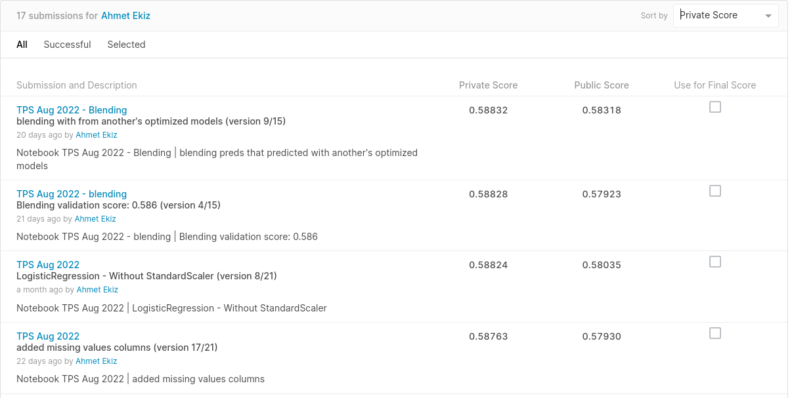

# Kaggle_TPS_2022_Aug
Tabular Playground Series - Aug 2022

You can see my best private and public scores on the [My Submission Scores](https://github.com/AhmetEkiz/Kaggle_TPS_2022_Aug/edit/main/README.md#my-notebooks) title. **It's not a good score** but I have learned, that sometimes I **should use fewer features** to make good predictions **because** **adding missing columns** for every column that has a missing value **decreased the score**. And I have **tried the first XGBoost** then I used **Logistic Regression** which everyone used. **Logistic Regression was better than XGBoost for starting**. So, I learned to need to try different preprocess methods and models. 

[Competition Home Page](https://www.kaggle.com/competitions/tabular-playground-series-aug-2022)

>The August 2022 edition of the Tabular Playground Series is an opportunity to help the fictional company Keep It Dry improve its main product Super Soaker. The product is used in factories to absorb spills and leaks.
>The company has just completed a large testing study for different product prototypes. Can you use this data to build a model that predicts product failures?

**Evaluation**: Submissions are evaluated on area under the ROC curve between the **predicted probability** and the observed target.

## My Notebooks

1. [TPS Aug 2022 - Starter](https://github.com/AhmetEkiz/Kaggle_TPS_2022_Aug/blob/main/tps-aug-2022-starter.ipynb)
1. [TPS Aug 2022 - Starter - Version 8](https://github.com/AhmetEkiz/Kaggle_TPS_2022_Aug/blob/main/tps-aug-2022-starter-version-8.ipynb) : This version is the best score of my **starter** notebooks.
1. [TPS Aug 2022 - Blending](https://github.com/AhmetEkiz/Kaggle_TPS_2022_Aug/blob/main/tps-aug-2022-blending.ipynb)
1. [TPS Aug 2022 - Blending - Version 4](https://github.com/AhmetEkiz/Kaggle_TPS_2022_Aug/blob/main/tps-aug-2022-blending-version-4.ipynb) : My Second Best Private Score Version
1. [TPS Aug 2022 - Blending - Version 9](https://github.com/AhmetEkiz/Kaggle_TPS_2022_Aug/blob/main/tps-aug-2022-blending-version-9.ipynb) : My Best Private Score Version

## My Submission Scores

